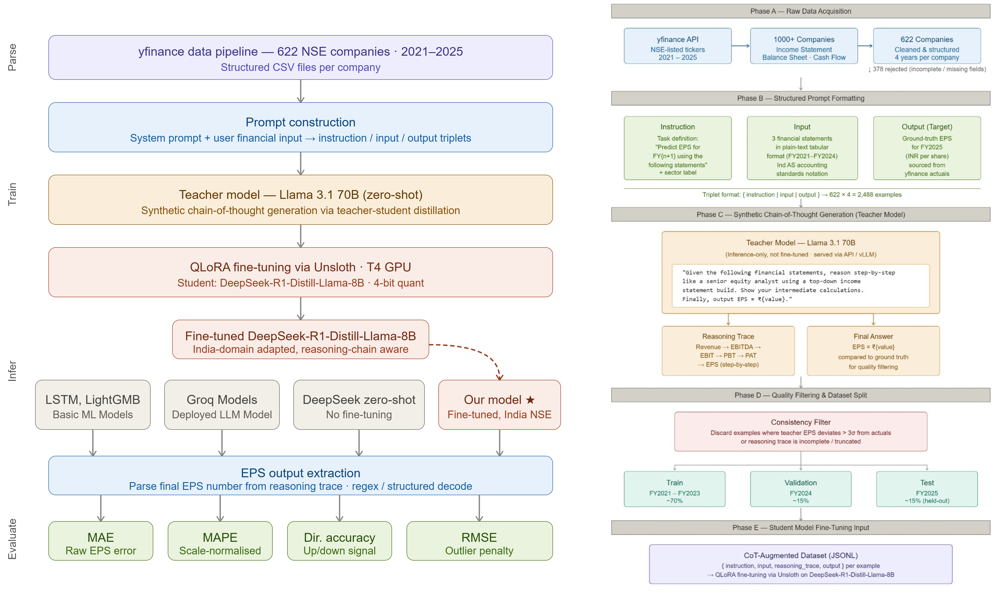
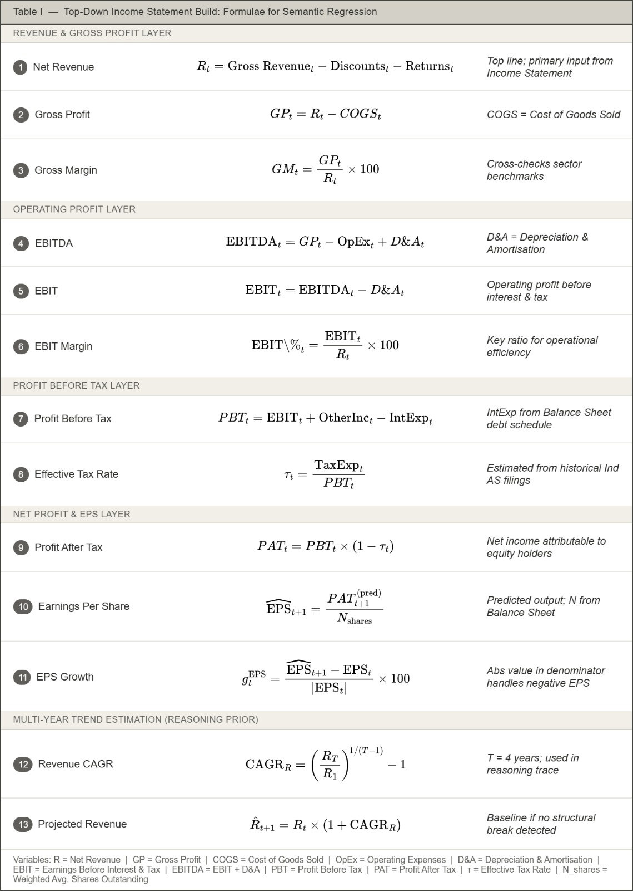
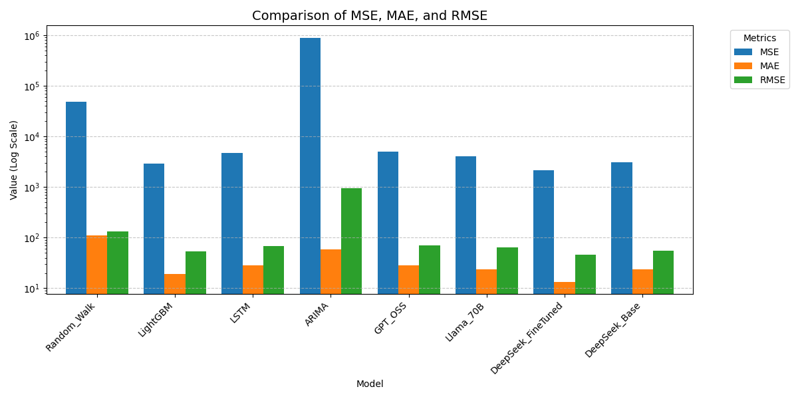
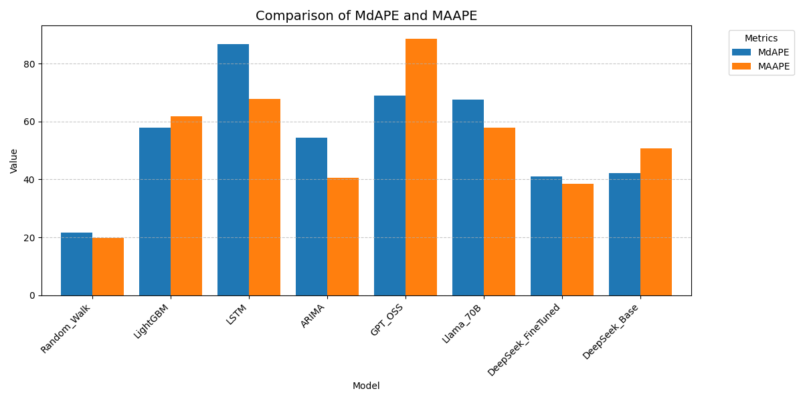
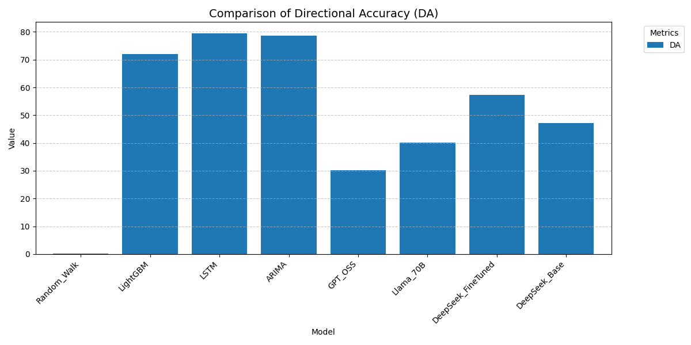

# Semantic Regression for EPS Forecasting on Indian Equity (Research Track)

This repository documents our ongoing research toward a publishable paper on EPS forecasting for Indian equities. Instead of treating EPS prediction as only a numerical time-series task, we frame it as a reasoning problem where a model learns to derive next-year EPS from financial statements through analyst-style intermediate steps. The work is scoped for research quality and reproducible experimentation, while product deployment is intentionally deferred.

## Project Focus
The project predicts next-year EPS (Earnings Per Share) from three core financial statements: Income Statement, Balance Sheet, and Cash Flow Statement. The central hypothesis is that a reasoning-oriented LLM can model financial logic more effectively than purely numerical pipelines by performing step-by-step semantic analysis (Semantic Regression).

## Current Status (What Is Done)
### 1. Problem framing finalized
The objective is finalized as next-year EPS prediction for due diligence workflows, and the project direction is explicitly paper-first rather than product-first.

### 2. Dataset creation completed
Using yfinance as the primary source, data for 1000+ NSE companies was extracted and 622 companies were successfully structured for research use. The dataset spans 2021-2025 and has been converted into instruction/input/output format suitable for LLM fine-tuning.

### 3. Reasoning supervision pipeline prepared
Reasoning supervision has been prepared through teacher-student distillation, where Llama 3.1 70B is used to generate synthetic reasoning chains that teach financial analysis logic instead of only final-point predictions.

### 4. Student model strategy finalized
The student strategy is finalized around DeepSeek-R1-Distill-Llama-8B with QLoRA (4-bit) via Unsloth, using a hardware-safe configuration aligned to the available 10GB H100 slice.

### 5. Baseline and evaluation design fixed
Planned comparison set:
| Baseline / Model | Purpose |
|---|---|
| Random Walk | Can we beat doing nothing? |
| LSTM / ARIMA | Can we beat classical time-series? |
| LightGBM | Can we beat best classical ML? |
| GPT OSS / Llama 70B | Can we beat powerful general LLMs? |
| DeepSeek-R1-Distill-Llama-8B zero-shot | Is fine-tuning even necessary? |
| Our fine-tuned model | Proposed method for final comparison |

Evaluation metrics:
- Based on unit:
	- MAE
	- MSE
	- RMSE
- Based on percentage:
	- MAAPE
	- MAPE
	- MdAPE
- Based on accuracy:
	- Directional Accuracy (DA)

## Visual Research Artifacts
### Main pipeline

	

<strong>Figure 1.</strong> End-to-end research pipeline for Semantic Regression-based EPS forecasting.

### Top-down EPS formulation

	

<strong>Figure 2.</strong> Top-down analytical formulae used in our EPS forecasting reasoning flow.

### Evaluation outputs
The following three plots are the current evaluation result artifacts (error_1, error_2, error_3 set).

	

<strong>Figure 3.</strong> Absolute error-oriented view used to inspect model miss magnitude across samples.

	

<strong>Figure 4.</strong> Percentage-based analysis to compare error behavior across different EPS scales.

	

<strong>Figure 5 (error_3).</strong> Accuracy-focused evaluation view, aligned with directional and forecast-quality interpretation.

## Important Research Decisions
### RAG direction was evaluated and rejected
An earlier RAG direction was explored but intentionally rejected because it does not provide sufficient novelty for the target paper. The active direction remains reasoning-chain distillation plus domain adaptation for India/NSE EPS forecasting.

### Scope intentionally limited for publication quality
Not in current scope:
Web app/product deployment, real-time API inference pipelines, and expansion beyond EPS are intentionally out of scope for this research phase.

## Planned Next Research Steps
The immediate next steps are to finalize a strict time-based train/validation/test split, run full fine-tuning and baseline experiments, and complete robust EPS extraction from reasoning outputs for metric computation. A sector-label layer may be added for richer analysis, followed by drafting the core paper sections: Methodology, Dataset, Experiments, Results, and Related Work.

Note: a future data-engineering pipeline for converting incoming financial data into clean CSV format is planned, but it is not part of the current finalized research update.

## Research Contribution Direction (Paper Narrative)
1. Reasoning-chain distillation for financial forecasting (70B teacher to 8B student).
2. NSE/India-focused EPS forecasting dataset and benchmark setup.
3. Domain adaptation finding: US-trained financial LLMs underperform on Indian market data compared to India-adapted tuning.

## Working Title
Semantic Regression via Reasoning-Chain Distillation for EPS Forecasting on Indian Equity Markets
